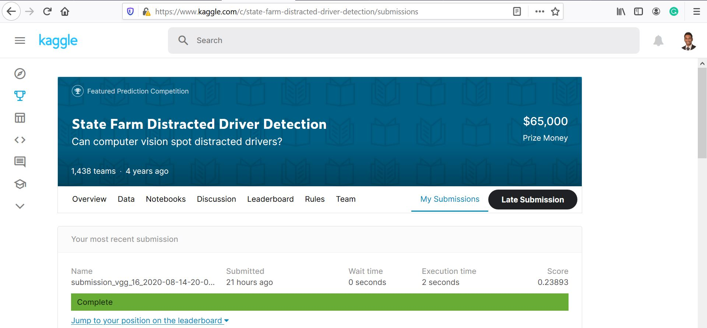

# Kaggle - Distracted Driver Detection - Model log loss - 0.22855

## Kaggle Competition link

https://www.kaggle.com/c/state-farm-distracted-driver-detection

## Submission Details

The predicted submission had a log loss score of 0.22855 on the private leader board
and 0.23893 on the public leader board

# Steps to run project code

## Packages to be installed

Following packages specified in requirements.txt file need to be installed - 
h5py, 
keras, 
numpy, 
opencv-python, 
pandas, 
scikit-learn and 
tensorflow-gpu

## Folders needed to run code

- Create folder named weights inside the project directory
- Create folders named cache and input one step above the project directory

## Download Competition Data

Download the competition data files from [Kaggle Competition Data Link](https://www.kaggle.com/c/state-farm-distracted-driver-detection/data) and place them in the data folder

## Download VGG_16 pretrained weights

Download the glove vector into project directory [Pre-Trained Glove Word Vector](https://gist.github.com/baraldilorenzo/07d7802847aaad0a35d3)
 
## Running Code

- The repository hosts 5 separate models all hosted in the \_\_main__.py file
- It is advised to run the code in pieces
- Each model has its individual code file that is capable of producing independent submissions
- The final submissions use the kaggle_distracted_drivers_vgg16.py file that uses pretrained vgg_16 weights
- For reference, it took me about a total of 0.5 days on my HP Spectre i5 to run each of first 4 simple models
- The vgg_16 model was run in aws sagemaker. I finally ended up using a ml.p3.2xlarge instance with GPU support

# Model
- The 5 models take the approach of step by step improvement
- The keras_simple model uses 2 convolution layers and runs 2 epochs and demonstrates what a simple model can achieve
- The keras_cv model uses a 10 fold cross validation and a smaller image size
- The keras_cv_drivers v1 and v2 splits the images for cross validation by drivers and uses image transformations
- The final model improves on the last approach by using a much more complex vgg_16 architecture, pretrained weights and larger image sizes
